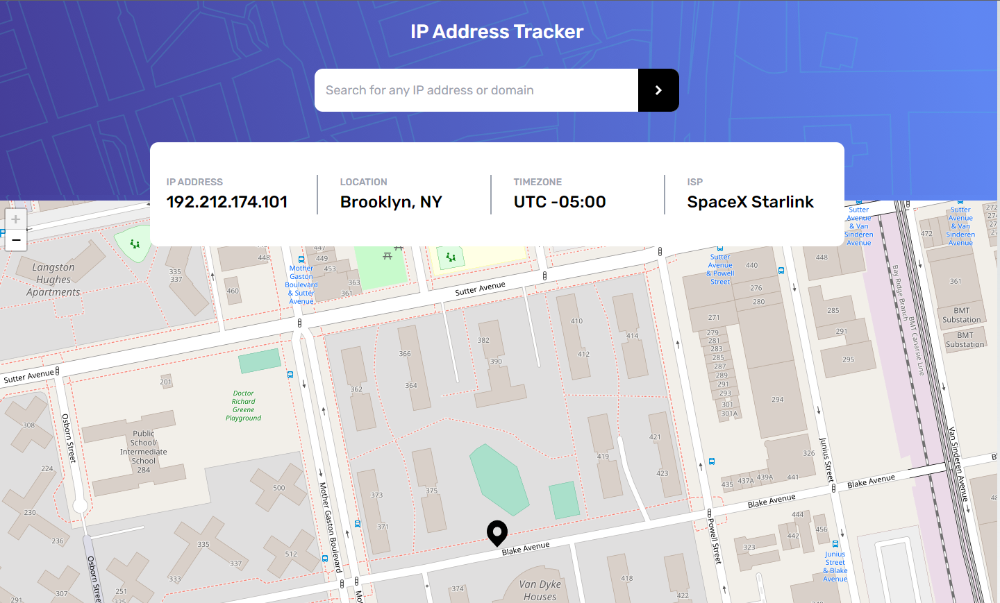

# Frontend Mentor - Solução do Ip Address Tracker

Essa é uma solução para o desafio Ip Address Tracker do Frontend MentorIO.

Projeto publicado: https://ip-address-tracker-haltshow.vercel.app/

## Sumário

- [Visão Geral](#visão-geral)
- [Foto](#foto)
- [Construção](#construído-com)
- [Autor](#autor)

## Visão Geral

Essa é uma solução para listar mostrar informações de um ip específico ao digitá-lo em tela. Também possui uma integração com um mapa que mostra o local rastreado pelo IP.

### Foto

Essa é uma foto de como ficou o desafio.

### Construído com

- NextJS
- Tailwind
- Typescript
- Flexbox
- Grid

## Autor

- Frontend Mentor - [@haltshow](https://www.frontendmentor.io/profile/haltshow)
- GitHub - [@haltshow](https://github.com/haltshow)
- GitLab - [@gabrielabreualves](https://gitlab.com/gabrielabreualves)